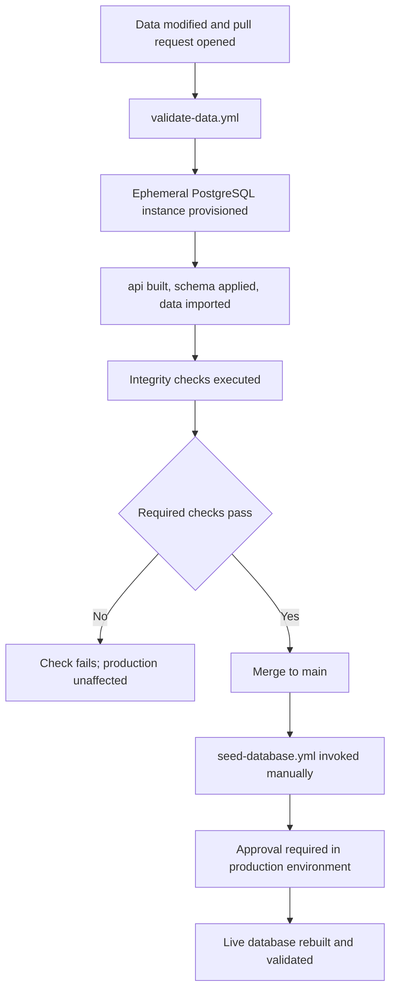

# CI/CD for the AnyonWiki database

Two GitHub Actions workflows keep the live site in sync with this repository.

The data lives here, but the Prisma schema and the import scripts live in the
private `anyonwiki/api` repository. Every job therefore checks out **both**
repositories side by side and runs `api`'s code against this repository's files.

| Repository | Provides |
| --- | --- |
| `anyonwiki/AnyonWikiDatabase` | The data, and these workflows |
| `anyonwiki/api` | Prisma schema, importers, validation script |

## Overview

## `validate-data.yml` — the safety gate

Answers "would this data break the site?" without going near production.

| Trigger | When |
| --- | --- |
| `pull_request` | Changes under `AlgebraicStructures/**`, `SupportingData/**` or `.github/workflows/**` |
| `push` to `main` | Changes under `AlgebraicStructures/**` or `SupportingData/**` |
| `workflow_dispatch` | Manually, optionally against a specific `api` ref |

Everything runs against a `postgres:16` service container with a throwaway
connection string. `npm run build` runs **before** any seeding, so a schema or
importer that no longer compiles fails fast.

> [!NOTE]
> The import order is fixed: algebraic numbers, then fusion rings, then fusion
> categories. Categories hold a foreign key to their parent ring and denormalize
> its Frobenius–Perron dimension, so rings must exist first.

## `seed-database.yml` — the deploy

Same steps, pointed at the live database.

> [!WARNING]
> This job runs `prisma db push --force-reset`, which **wipes and rebuilds the
> live database**. It is intentionally manual only — the `push` trigger is
> commented out so it can never fire automatically on merge.

It declares `environment: production`, so adding required reviewers there gives
you an approval step before anything is destroyed.

## Required secrets

| Secret | Scope | Used by |
| --- | --- | --- |
| `API_REPO_TOKEN` | Repository secret | Both workflows, to check out the private `api` repo |
| `DATABASE_URL` | **Environment** secret on `production` | `seed-database.yml` only |

`API_REPO_TOKEN` is needed because the automatic `GITHUB_TOKEN` is scoped to the
repository running the workflow and cannot check out a second repository. A
fine-grained PAT limited to `anyonwiki/api` with **Contents: read-only** is
enough. If `api` ever becomes public, delete the `token:` lines instead.

> [!IMPORTANT]
> Use Railway's `DATABASE_PUBLIC_URL`, not `DATABASE_URL`. The default points at
> `*.railway.internal`, which only resolves inside Railway's network — a GitHub
> runner cannot reach it.

Keeping `DATABASE_URL` as an *environment* secret rather than a repository
secret means only the seed job can read it, not any workflow added in a PR.

## What gets validated

Required checks — these fail the run

- Fusion rings, fusion categories and algebraic numbers are all non-empty
- No orphaned categories (every parent ring resolves)
- A sample ring has a 4-element code, a multiplication table and a rank
- A sample category has a 7-element code and a parent ring link
- Categories carry a denormalized Frobenius–Perron dimension
- Every algebraic number has a decoded numeric value
- Sampled numeric values satisfy their own minimal polynomial

Warnings — reported but do not block

- Category algebraic references resolve

  165 qqb_ids referenced by categories are missing from
  `SupportingData/AlgebraicNumbers`. The site derives an exact value from the id
  itself, so this is surfaced without blocking unrelated data updates.

## Setup checklist

- [ ] Create the `API_REPO_TOKEN` repository secret
- [ ] Create a `production` environment with required reviewers
- [ ] Add `DATABASE_URL` as an environment secret on `production`
- [ ] Confirm `API_REPO` in both workflows matches the real `api` repository path
- [ ] Push `api` so the workflows check out current importers
- [ ] Merge this branch to `main`
- [ ] Enable branch protection on `main` requiring the `validate` check
- [ ] Run `seed-database.yml` manually for the first production seed

> [!NOTE]
> `workflow_dispatch` only appears in the Actions UI once the workflow file is on
> the **default branch**. `seed-database.yml` will not be runnable until this
> branch is merged. `validate-data.yml` is unaffected — pull request workflows
> run the version of the file on the PR branch.
